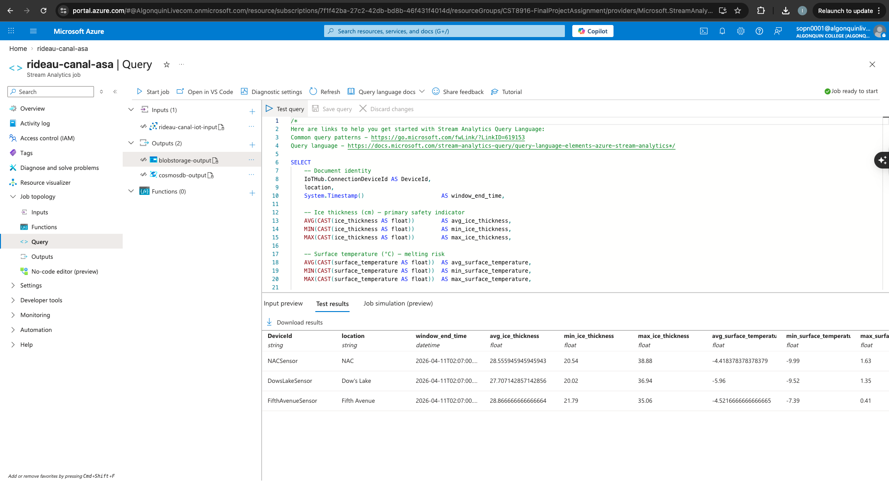
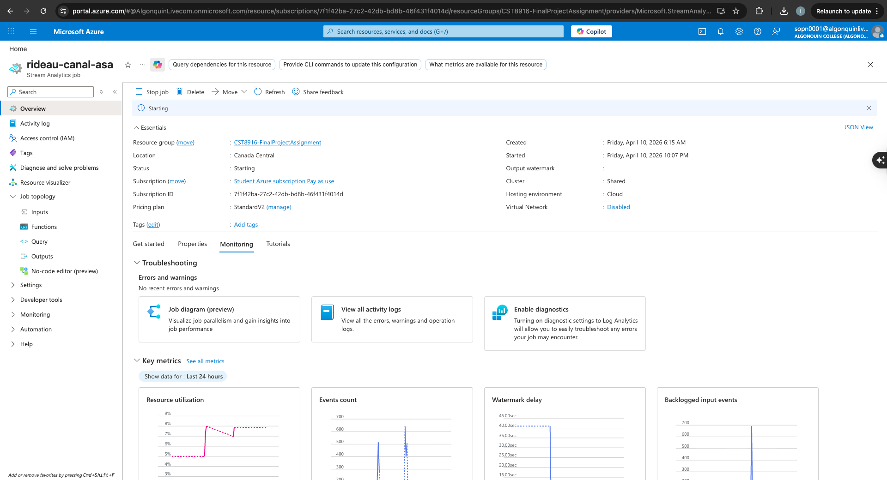
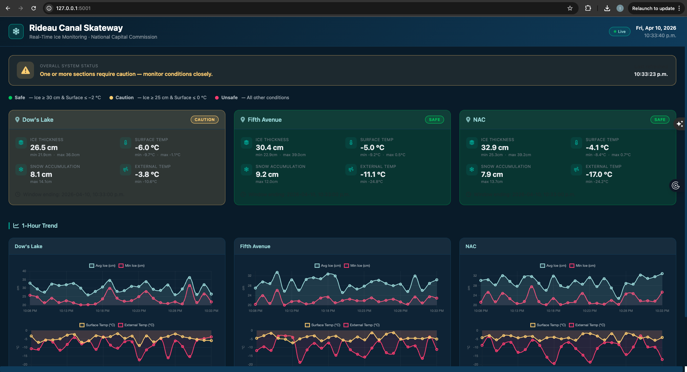

# Rideau Canal Skateway – Real-Time Ice Monitoring System

---

## Table of Contents

1. [Project Description](#2-project-description)
2. [Student Information](#1-student-information)
3. [Scenario Overview](#3-scenario-overview)
4. [System Architecture](#4-system-architecture)
5. [Implementation Overview](#5-implementation-overview)
6. [Repository Links](#6-repository-links)
7. [Video Demonstration](#7-video-demonstration)
8. [Setup Instructions](#8-setup-instructions)
9. [Results and Analysis](#9-results-and-analysis)
10. [Challenges and Solutions](#10-challenges-and-solutions)
11. [AI Tools Disclosure](#11-ai-tools-disclosure)
12. [References](#12-references)

---

## 1. Project Description

A cloud-native IoT pipeline that monitors ice safety in real time at three locations along Ottawa's Rideau Canal Skateway. Simulated sensors send telemetry every 10 seconds to Azure IoT Hub. Azure Stream Analytics aggregates the data into 5-minute windows and routes results to Cosmos DB (live dashboard) and Blob Storage (historical archive). A Flask dashboard on Azure App Service displays live status and trends.

---

## 2. Student Information

**Name:** Idris Jovial Sop Nwabo

**Student ID:** 041199877  

**Course:** CST8916 – Remote Data and Real-Time Application


#### Links to all three repositories
| Repository | URL |
|---|---|
| Main Documentation (this repo) | https://github.com/sopn0001/CST8916_Final_Project |
| IoT Sensor Simulation | https://github.com/sopn0001/rideau-canal-sensor-simulation|
| Web Dashboard | https://github.com/sopn0001/rideau-canal-dashboard |

---


## 3. Scenario Overview

### Problem Statement

The National Capital Commission (NCC) manually inspects ice conditions on the Rideau Canal Skateway – the world's largest naturally frozen skating rink. Manual checks cannot provide continuous visibility into rapidly changing conditions. An automated, real-time monitoring system is needed to evaluate safety and inform decisions about opening or closing canal sections.

### System Objectives

1. Collect sensor readings every 10 seconds from Dow's Lake, Fifth Avenue, and NAC.
2. Compute 5-minute windowed statistics (AVG, MIN, MAX) for all metrics.
3. Automatically classify each window as `Safe`, `Caution`, or `Unsafe` using NCC thresholds.
4. Persist results to Cosmos DB (live reads) and Blob Storage (archive).
5. Display live status and trends on an auto-refreshing web dashboard.

### Monitored Metrics

| Metric | Unit | Description |
|---|---|---|
| `ice_thickness` | cm | Ice depth – primary safety indicator |
| `surface_temperature` | °C | Surface temperature – melting risk |
| `snow_accumulation` | cm | Snow depth on the ice |
| `external_temperature` | °C | Ambient air temperature |

---

## 4. System Architecture


```
Sensor Simulator (3 threads, one per location)
        │  JSON every 10 s
        ▼
Azure IoT Hub  ──►  Azure Stream Analytics
                         │  TumblingWindow(minute, 5) GROUP BY location
                         ├──► Cosmos DB  (live dashboard reads)
                         └──► Blob Storage  (historical archive)
                                    │
                              Flask Dashboard (Azure App Service)
```

### Azure Services

| Service | Purpose | Tier |
|---|---|---|
| Azure IoT Hub | Device-to-cloud ingestion | Free (F1) |
| Azure Stream Analytics | Windowed aggregation & routing | Standard |
| Azure Cosmos DB | Low-latency document store | Serverless |
| Azure Blob Storage | JSON historical archive | Standard LRS |
| Azure App Service | Host Flask dashboard | Free (F1) |

---

## 5. Implementation Overview

### IoT Sensor Simulation
**Repo:** [rideau-canal-sensor-simulation](https://github.com/sopn0001/rideau-canal-sensor-simulation)

`sensor_simulator.py` runs three threads (one per location), each sending a JSON telemetry message to IoT Hub every 10 seconds with randomly generated values in realistic ranges.

```json
{
  "location": "Dow's Lake",
  "timestamp": "2026-01-15T14:03:22.451Z",
  "ice_thickness": 33.2,
  "surface_temperature": -4.1,
  "snow_accumulation": 6.7,
  "external_temperature": -12.3
}
```

### Azure IoT Hub Configuration

Three devices registered: `DowsLakeSensor`, `FifthAvenueSensor`, `NACSensor`. Stream Analytics reads from the `$Default` consumer group with JSON/UTF-8 serialization.

### Stream Analytics Job

A 5-minute non-overlapping TumblingWindow grouped by `location` produces one aggregated document per location per window, written simultaneously to Cosmos DB and Blob Storage. Safety status uses worst-case values: `MIN(ice_thickness)` and `MAX(surface_temperature)`.

**Full query:** [`stream_analytics/query.sql`](stream_analytics/query.sql)

```sql
-- Output 1 -> Storing in Cosmos DB 

SELECT
    IoTHub.ConnectionDeviceId AS DeviceId, location,
    System.Timestamp()        AS window_end_time,
    AVG(CAST(ice_thickness AS float))        AS avg_ice_thickness,
    MIN(CAST(ice_thickness AS float))        AS min_ice_thickness,
    MAX(CAST(ice_thickness AS float))        AS max_ice_thickness,
    AVG(CAST(surface_temperature AS float))  AS avg_surface_temperature,
    MIN(CAST(surface_temperature AS float))  AS min_surface_temperature,
    MAX(CAST(surface_temperature AS float))  AS max_surface_temperature,
    AVG(CAST(snow_accumulation AS float))    AS avg_snow_accumulation,
    MAX(CAST(snow_accumulation AS float))    AS max_snow_accumulation,
    AVG(CAST(external_temperature AS float)) AS avg_external_temperature,
    MIN(CAST(external_temperature AS float)) AS min_external_temperature,
    COUNT(*) AS reading_count,
    CASE
        WHEN MIN(CAST(ice_thickness AS float)) >= 30
         AND MAX(CAST(surface_temperature AS float)) <= -2 THEN 'Safe'
        WHEN MIN(CAST(ice_thickness AS float)) >= 25
         AND MAX(CAST(surface_temperature AS float)) <= 0  THEN 'Caution'
        ELSE 'Unsafe'
    END AS safety_status
INTO [cosmosdb-output]   -- repeated with INTO [blob-output] for archive
FROM [iothub-input]
GROUP BY location, IoTHub.ConnectionDeviceId, TumblingWindow(minute, 5)


-- Output 2 -> Storing in Blob Storage 

SELECT
    IoTHub.ConnectionDeviceId AS DeviceId,
    location,
    System.Timestamp()                       AS window_end_time,

    AVG(CAST(ice_thickness AS float))        AS avg_ice_thickness,
    MIN(CAST(ice_thickness AS float))        AS min_ice_thickness,
    MAX(CAST(ice_thickness AS float))        AS max_ice_thickness,

    AVG(CAST(surface_temperature AS float))  AS avg_surface_temperature,
    MIN(CAST(surface_temperature AS float))  AS min_surface_temperature,
    MAX(CAST(surface_temperature AS float))  AS max_surface_temperature,

    AVG(CAST(snow_accumulation AS float))    AS avg_snow_accumulation,
    MAX(CAST(snow_accumulation AS float))    AS max_snow_accumulation,

    AVG(CAST(external_temperature AS float)) AS avg_external_temperature,
    MIN(CAST(external_temperature AS float)) AS min_external_temperature,

    COUNT(*)                                 AS reading_count,

    CASE
        WHEN MIN(CAST(ice_thickness AS float)) >= 30
         AND MAX(CAST(surface_temperature AS float)) <= -2
        THEN 'Safe'

        WHEN MIN(CAST(ice_thickness AS float)) >= 25
         AND MAX(CAST(surface_temperature AS float)) <= 0
        THEN 'Caution'

        ELSE 'Unsafe'
    END AS safety_status

INTO
    [blob-output]
FROM
    [iothub-input]
GROUP BY
    location,
    IoTHub.ConnectionDeviceId, TumblingWindow(minute, 5)
```

### Cosmos DB Setup

Database: `RideauCanalDB` | Container: `SensorAggregations` | Partition key: `/location` | Capacity: Serverless

### Blob Storage Configuration

Container: `rideau-canal-container` | Path pattern: `aggregations/{date}/{time}` | Format: JSON, line-separated

### Web Dashboard
**Repo:** [rideau-canal-dashboard](https://github.com/sopn0001/rideau-canal-dashboard)

Flask single-page app that auto-refreshes every 30 seconds. Features: overall safety banner, per-location status cards with colour-coded badges (Safe / Caution / Unsafe), metric blocks (avg/min/max), 1-hour Chart.js trend charts, and a live Ottawa clock. Deployed as a Linux Python 3.11 web app on Azure App Service (Free F1 tier) via zip deploy.

**Safety thresholds (applied in both Stream Analytics and Flask fallback):**

| Ice Thickness | Surface Temp | Status |
|---|---|---|
| ≥ 30 cm | ≤ −2 °C | **Safe** |
| ≥ 25 cm | ≤ 0 °C | **Caution** |
| Either fails | — | **Unsafe** |

---

## 6. Repository Links

| Resource | Link |
|---|---|
| Main Documentation | https://github.com/sopn0001/CST8916_Final_Project |
| IoT Sensor Simulation | https://github.com/sopn0001/rideau-canal-sensor-simulation |
| Web Dashboard | https://github.com/sopn0001/rideau-canal-dashboard |
| Live Dashboard | https://rideau-canal-dashboard.azurewebsites.net |

---

## 7. Video Demonstration

> **[Watch the Demo on YouTube](https://www.youtube.com/watch?v=crR5js1IffI)**

Covers: sensor simulator startup → IoT Hub message flow → Stream Analytics job → Cosmos DB documents → Blob Storage archive → live dashboard.

---

## 8. Setup Instructions

**Prerequisites:** Python 3.10+, Azure CLI (`az login`), active Azure subscription, Git

**1. Clone repositories**

```bash
git clone https://github.com/sopn0001/rideau-canal-sensor-simulation
git clone https://github.com/sopn0001/rideau-canal-dashboard
```

**2. Provision Azure resources** (all in resource group `rg-rideau-canal`, region `canadacentral`)

- Create IoT Hub (`rideau-canal-hub`, F1) and register three devices: `DowsLakeSensor`, `FifthAvenueSensor`, `NACSensor`.
- Create Cosmos DB account (`rideau-canal-cosmos`, Serverless), database `RideauCanalDB`, container `SensorAggregations` with partition key `/location`.
- Create Storage account (`finalassignmentstorage`, Standard LRS) and container `historical-data`.

**3. Configure Stream Analytics** — Create the job in the Azure Portal. Add IoT Hub input (`iothub-input`), Cosmos DB output (`cosmosdb-output`), and Blob Storage output (`blob-output`). Paste `stream_analytics/query.sql` into the query editor and start the job.

**4. Run the sensor simulator**

```bash
cd rideau-canal-sensor-simulation
pip install -r requirements.txt
# Add device connection strings to SENSOR_CONNECTIONS in sensor_simulator.py
python sensor_simulator.py
```

**5. Run the dashboard locally**

```bash
cd rideau-canal-dashboard
pip install -r requirements.txt
export COSMOS_URL="https://rideau-canal-cosmos.documents.azure.com:443/"
export COSMOS_KEY="<YOUR_PRIMARY_KEY>"
export COSMOS_DATABASE="RideauCanalDB"
export COSMOS_CONTAINER="SensorAggregations"
python app.py   # → http://localhost:5000
```

For full deployment steps (App Service, app settings), see the individual component repositories.

---

## 9. Results and Analysis

### Screenshots

| | |
|---|---|
|  **IoT Hub – Registered Devices** |  **IoT Hub – Message Metrics** |
|  **Stream Analytics – Query Editor** |  **Stream Analytics – Job Running** |
|  **Cosmos DB – Aggregated Documents** |  **Blob Storage – Archived Files** |
|  **Dashboard – Local** |  **Dashboard – Azure App Service** |

### Sample Cosmos DB Document

```json
{
  "DeviceId": "sensor-dows-lake",
  "location": "Dow's Lake",
  "window_end_time": "2026-01-15T14:05:00.000Z",
  "avg_ice_thickness": 31.4,
  "min_ice_thickness": 29.1,
  "max_ice_thickness": 33.8,
  "avg_surface_temperature": -3.7,
  "max_surface_temperature": -2.1,
  "avg_snow_accumulation": 5.3,
  "avg_external_temperature": -11.6,
  "reading_count": 30,
  "safety_status": "Safe"
}
```

### Observations

- Each 5-minute window captures ~30 readings per location.
- `min_ice_thickness` is the most safety-critical field: a single low reading can trigger `Unsafe` even if the average is acceptable.
- End-to-end latency is ~5–6 minutes, dominated by the window duration.
- Cosmos DB serverless mode was cost-effective for the prototype's low query frequency.

---

## 10. Challenges and Solutions

**Window latency vs. dashboard freshness** — The 5-minute window made the dashboard appear stale. Fixed by displaying the `window_end_time` timestamp on each card so users can see exactly when data was last computed.

**Cosmos DB partition key** — Using `{location}-{timestamp}` as the partition key caused expensive cross-partition fan-out queries. Changed to `/location` (three fixed values) to keep all dashboard queries single-partition.

**Dual-output query duplication** — Stream Analytics requires a separate `SELECT … INTO` per output, risking the two copies diverging. Solved by maintaining both statements in a single `query.sql` file and applying all changes to both blocks simultaneously.

**Device connection string secrets** — SAS tokens must not be committed to version control. Connection strings are loaded from environment variables or a `.env` file excluded by `.gitignore`.

**App Service cold start** — The Free F1 tier has no always-on option, causing a slow first load after idle periods. Documented the behaviour; upgrading to B1 (always-on) is recommended for production.

---

## 11. AI Tools Disclosure

AI assistance was used in accordance with Algonquin College's academic integrity guidelines.

| Tool | How It Was Used |
|---|---|
| GitHub Copilot | Inline code suggestions (threading, Jinja2, Chart.js dataset config) |
| Cursor (Claude Sonnet) | README formatting, CAST syntax suggestions, debugging |

All suggestions were reviewed, tested, and adapted by me. Architecture design, system decisions, and all core logic are my own work.

---

## 12. References

- [Azure IoT Hub – Device-to-Cloud Messaging](https://learn.microsoft.com/en-us/azure/iot-hub/iot-hub-devguide-messages-d2c)
- [Azure Stream Analytics – Windowing Functions](https://learn.microsoft.com/en-us/azure/stream-analytics/stream-analytics-window-functions)
- [Azure Cosmos DB – Serverless](https://learn.microsoft.com/en-us/azure/cosmos-db/serverless)
- [Azure App Service – Deploy Python Apps](https://learn.microsoft.com/en-us/azure/app-service/quickstart-python)
- [NCC Rideau Canal Skateway](https://ncc-ccn.gc.ca/places/rideau-canal-skateway)
- [Chart.js Documentation](https://www.chartjs.org/docs/latest/)
- Libraries: `azure-iot-device` ≥ 2.12 · `azure-cosmos` ≥ 4.5 · `flask` ≥ 3.0 · `python-dotenv` ≥ 1.0

---

