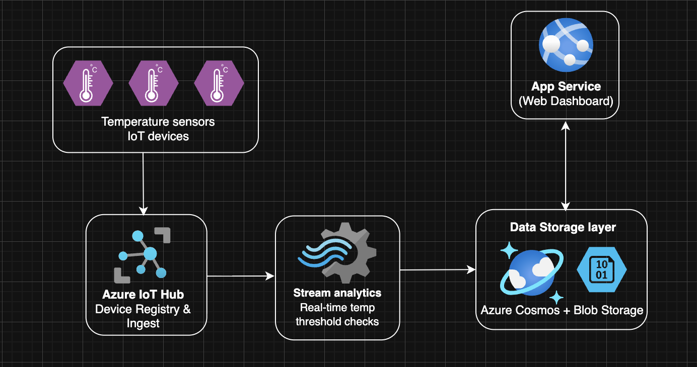
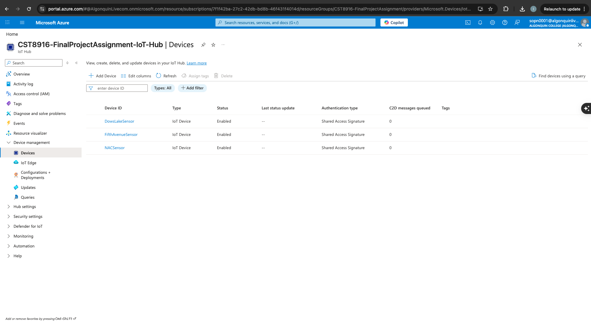
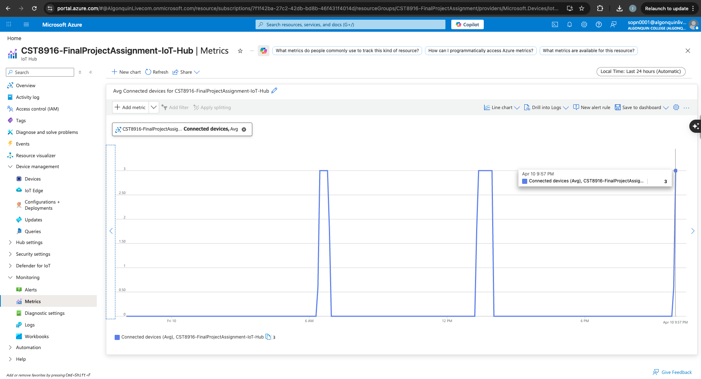
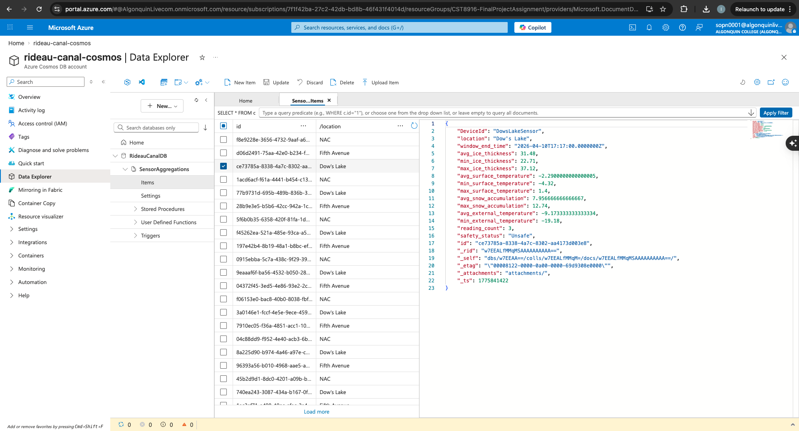
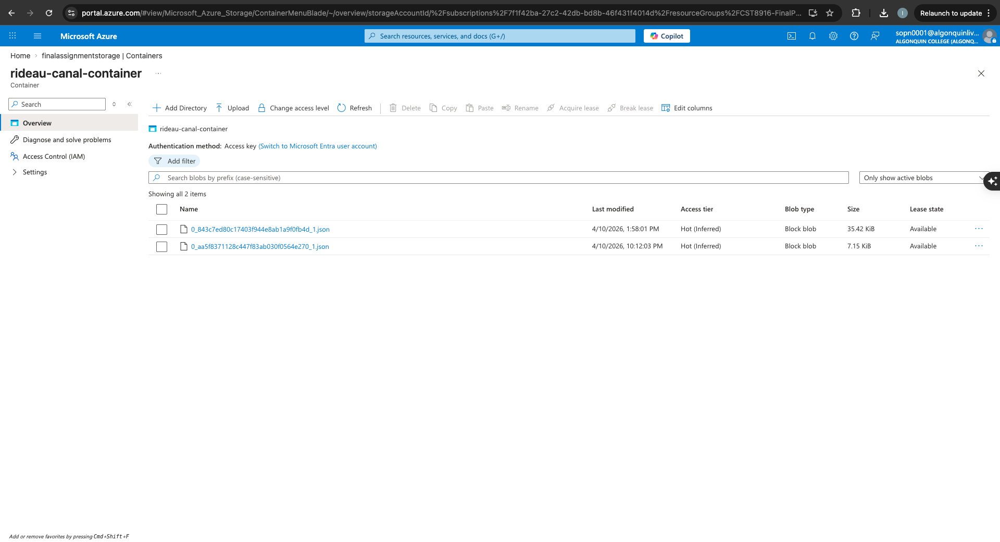
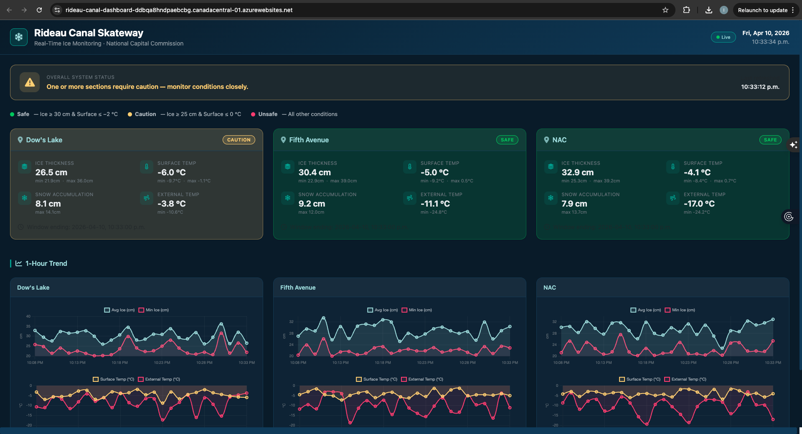

# Rideau Canal Skateway – Real-Time Ice Monitoring System

**Institution:** Algonquin College 
**Course:** CST8916 – Remote Data and Real-Time Application  
**Name:** IDRIS JOVIAL SOP NWABO
**Student ID:** 041199877
**Course:** CST8916

---

## Table of Contents

1. [Student Information](#1-student-information)
2. [Project Description](#2-project-description)
3. [Scenario Overview](#3-scenario-overview)
4. [System Architecture](#4-system-architecture)
5. [Implementation Overview](#5-implementation-overview)
6. [Repository Links](#6-repository-links)
7. [Video Demonstration](#7-video-demonstration)
8. [Setup Instructions](#8-setup-instructions)
9. [Results and Analysis](#9-results-and-analysis)
10. [Challenges and Solutions](#10-challenges-and-solutions)
11. [AI Tools Disclosure](#11-ai-tools-disclosure)
12. [References](#12-references)

---

## 1. Student Information

| Field | Details |
|---|---|
| **Name** | Idris Jovial Sop Nwabo |
| **Student ID** | 123456789 |
| **Course** | CST8916 – Remote Data and Real-Time Application |
| **Institution** | Algonquin College |
| **Submission Date** | April 2026 |

### Repository Links

| Repository | URL |
|---|---|
| Main Documentation (this repo) | https://github.com/yourusername/rideau-canal-monitoring |
| IoT Sensor Simulation | https://github.com/sopn0001/rideau-canal-sensor-simulation |
| Web Dashboard | https://github.com/sopn0001/rideau-canal-dashboard |

---

## 2. Project Description

The **Rideau Canal Skateway Real-Time Ice Monitoring System** is a cloud-native IoT pipeline that continuously tracks ice safety conditions at three locations along the Rideau Canal in Ottawa, Ontario. The system ingests telemetry from simulated IoT sensors, processes it in real time using Azure Stream Analytics, persists aggregated results to both a live database (Cosmos DB) and a historical archive (Blob Storage), and surfaces the data through an auto-refreshing web dashboard.

| Capability | Technology |
|---|---|
| Simulate IoT sensors at 3 locations | Python + `azure-iot-device` |
| Ingest raw telemetry | **Azure IoT Hub** |
| Aggregate into 5-minute windows | **Azure Stream Analytics** |
| Fast read access (dashboard) | **Azure Cosmos DB** |
| Long-term archive | **Azure Blob Storage** |
| Live web dashboard | **Flask** on **Azure App Service** |

---

## 3. Scenario Overview

### Problem Statement

The Rideau Canal Skateway is the world's largest naturally frozen skating rink, attracting hundreds of thousands of visitors each winter season. The National Capital Commission (NCC) is responsible for monitoring ice safety and deciding when sections of the canal are safe to open or must be closed. Currently, manual inspections are labour-intensive and cannot provide continuous, real-time visibility into changing ice conditions caused by temperature fluctuations, snowfall, or solar radiation.

A data-driven monitoring solution is needed that can:

- Continuously collect ice condition data from multiple locations along the canal.
- Automatically evaluate safety status against NCC-defined thresholds.
- Alert operators and inform the public through a live dashboard.
- Store historical records for trend analysis and auditing.

### System Objectives

1. **Real-time ingestion** – Receive sensor readings every 10 seconds from three canal locations.
2. **Automated aggregation** – Compute 5-minute windowed statistics (AVG, MIN, MAX) for all metrics.
3. **Safety classification** – Automatically assign a `Safe`, `Caution`, or `Unsafe` status per location per window using NCC threshold logic.
4. **Dual persistence** – Write aggregated results to Cosmos DB (low-latency dashboard reads) and Blob Storage (long-term archive).
5. **Live visualization** – Serve a web dashboard that auto-refreshes every 30 seconds and displays trend charts.

### Monitored Metrics (per location)

| Metric | Unit | Description |
|---|---|---|
| `ice_thickness` | cm | Depth of the ice layer – primary safety indicator |
| `surface_temperature` | °C | Temperature at the ice surface – melting risk |
| `snow_accumulation` | cm | Depth of snow on the ice |
| `external_temperature` | °C | Ambient air temperature |

### Monitored Locations

- **Dow's Lake** – southern anchor of the canal
- **Fifth Avenue** – mid-canal section
- **NAC** – northern end near the National Arts Centre

---

## 4. System Architecture

### Architecture Diagram



### ASCII Overview

```
┌─────────────────────────────────────────────────────────────────────┐
│                        Sensor Simulator                             │
│  sensor_simulator.py                                                │
│  ┌─────────────┐  ┌─────────────────┐  ┌───────────────┐           │
│  │  Dow's Lake │  │  Fifth Avenue   │  │      NAC      │           │
│  │  (Thread 1) │  │   (Thread 2)    │  │  (Thread 3)   │           │
│  └──────┬──────┘  └────────┬────────┘  └───────┬───────┘           │
│         │                  │                   │                   │
│         └──────────────────┼───────────────────┘                   │
│                            │  JSON over MQTT/AMQP                  │
└────────────────────────────┼──────────────────────────────────────-┘
                             ▼
              ┌──────────────────────────┐
              │      Azure IoT Hub       │
              │  (event ingestion layer) │
              └──────────────┬───────────┘
                             │
                             ▼
              ┌──────────────────────────┐
              │  Azure Stream Analytics  │
              │  • 5-minute Tumbling     │
              │    Window per location   │
              │  • AVG / MIN / MAX of    │
              │    all four metrics      │
              │  • Safety CASE logic     │
              └────────┬─────────┬───────┘
                       │         │
              ┌────────▼──┐  ┌───▼─────────────┐
              │ Cosmos DB │  │  Blob Storage    │
              │ (live     │  │  (historical     │
              │  reads)   │  │   archive)       │
              └────────┬──┘  └──────────────────┘
                       │
                       ▼
              ┌──────────────────────────┐
              │   Flask Dashboard        │
              │   Azure App Service      │
              │   • Auto-refresh 30 s    │
              │   • Safety status badge  │
              │   • 2-hour trend charts  │
              └──────────────────────────┘
```

### Data Flow Explanation

```
Sensor Simulator
   │  JSON message every 10 s per location
   │  { location, timestamp, ice_thickness, surface_temperature,
   │    snow_accumulation, external_temperature }
   ▼
Azure IoT Hub  (rideau-canal-hub)
   │  Event Hub-compatible endpoint
   ▼
Azure Stream Analytics  (rideau-canal-asa)
   │  TumblingWindow(minute, 5) GROUP BY location
   │  → AVG/MIN/MAX of all metrics + safety_status CASE
   │  → DeviceId = IoTHub.ConnectionDeviceId
   │
   ├──► Cosmos DB  (RideauCanalDB / SensorAggregations)
   │       Partition key: /location
   │       ↓
   │    Flask Dashboard (/api/latest, /api/all-history)
   │       → Overall status banner
   │       → Per-location status cards
   │       → 1-hour trend charts
   │
   └──► Blob Storage  (historical-data)
           Path: aggregations/{date}/{time}
           Format: JSON, line-separated
```

### Azure Services Used

| Service | Purpose | Tier |
|---|---|---|
| **Azure IoT Hub** | Device-to-cloud message ingestion | Free (F1) |
| **Azure Stream Analytics** | Real-time windowed aggregation and routing | Standard |
| **Azure Cosmos DB (SQL API)** | Low-latency document store for dashboard reads | Serverless |
| **Azure Blob Storage** | Long-term JSON archive for historical analysis | Standard LRS |
| **Azure App Service** | Host and scale the Flask web dashboard | Free (F1) |

---

## 5. Implementation Overview

### IoT Sensor Simulation

**Repository:** [rideau-canal-sensor-simulation](https://github.com/sopn0001/rideau-canal-sensor-simulation)

`sensor_simulator.py` spawns three independent threads – one per canal location. Each thread connects to Azure IoT Hub using a device-specific AMQP/MQTT connection string and sends a JSON telemetry message every 10 seconds. Values are randomly generated within realistic ranges to simulate real-world seasonal variation:

| Metric | Simulated Range |
|---|---|
| Ice thickness | 20 – 45 cm |
| Surface temperature | −10 – +2 °C |
| Snow accumulation | 0 – 15 cm |
| External temperature | −20 – +5 °C |

Example message payload:

```json
{
  "location": "Dow's Lake",
  "timestamp": "2026-01-15T14:03:22.451Z",
  "ice_thickness": 33.2,
  "surface_temperature": -4.1,
  "snow_accumulation": 6.7,
  "external_temperature": -12.3
}
```

### Azure IoT Hub Configuration

Three virtual devices are registered in the hub – one per monitored location:

| Device ID | Location |
|---|---|
| `sensor-dows-lake` | Dow's Lake |
| `sensor-fifth-ave` | Fifth Avenue |
| `sensor-nac` | NAC |

The hub uses the built-in `$Default` consumer group for Stream Analytics input. The Free tier (`F1`) supports up to 8,000 messages/day, sufficient for three sensors sending every 10 seconds.

### Stream Analytics Job

The job reads from IoT Hub and uses a **5-minute non-overlapping TumblingWindow**, grouped by `location`, to produce one aggregated document per location per window. The same query writes simultaneously to both outputs.

**Full Query (`stream_analytics/query.sql`):**

```sql
-- =============================================================================
-- Rideau Canal Skateway – Azure Stream Analytics Query
-- =============================================================================
-- Inputs  : [iothub-input]       – Azure IoT Hub
-- Outputs : [cosmosdb-output]    – Azure Cosmos DB
--           [blob-output]        – Azure Blob Storage
--
-- Window  : 5-minute non-overlapping TumblingWindow, grouped by location.
--
-- Safety Status Logic (applied per window):
--   Safe    : MIN(ice_thickness) >= 30 cm  AND MAX(surface_temperature) <= -2 °C
--   Caution : MIN(ice_thickness) >= 25 cm  AND MAX(surface_temperature) <=  0 °C
--   Unsafe  : all other conditions
-- =============================================================================

-- Output 1 -> Cosmos DB

SELECT
    IoTHub.ConnectionDeviceId             AS DeviceId,
    location,
    System.Timestamp()                    AS window_end_time,

    AVG(CAST(ice_thickness AS float))     AS avg_ice_thickness,
    MIN(CAST(ice_thickness AS float))     AS min_ice_thickness,
    MAX(CAST(ice_thickness AS float))     AS max_ice_thickness,

    AVG(CAST(surface_temperature AS float))  AS avg_surface_temperature,
    MIN(CAST(surface_temperature AS float))  AS min_surface_temperature,
    MAX(CAST(surface_temperature AS float))  AS max_surface_temperature,

    AVG(CAST(snow_accumulation AS float)) AS avg_snow_accumulation,
    MAX(CAST(snow_accumulation AS float)) AS max_snow_accumulation,

    AVG(CAST(external_temperature AS float)) AS avg_external_temperature,
    MIN(CAST(external_temperature AS float)) AS min_external_temperature,

    COUNT(*)                              AS reading_count,

    CASE
        WHEN MIN(CAST(ice_thickness AS float)) >= 30
         AND MAX(CAST(surface_temperature AS float)) <= -2
        THEN 'Safe'

        WHEN MIN(CAST(ice_thickness AS float)) >= 25
         AND MAX(CAST(surface_temperature AS float)) <= 0
        THEN 'Caution'

        ELSE 'Unsafe'
    END AS safety_status

INTO [cosmosdb-output]
FROM [iothub-input]
GROUP BY
    location, IoTHub.ConnectionDeviceId,
    TumblingWindow(minute, 5)


-- Output 2 -> Blob Storage

SELECT
    IoTHub.ConnectionDeviceId             AS DeviceId,
    location,
    System.Timestamp()                    AS window_end_time,

    AVG(CAST(ice_thickness AS float))     AS avg_ice_thickness,
    MIN(CAST(ice_thickness AS float))     AS min_ice_thickness,
    MAX(CAST(ice_thickness AS float))     AS max_ice_thickness,

    AVG(CAST(surface_temperature AS float))  AS avg_surface_temperature,
    MIN(CAST(surface_temperature AS float))  AS min_surface_temperature,
    MAX(CAST(surface_temperature AS float))  AS max_surface_temperature,

    AVG(CAST(snow_accumulation AS float)) AS avg_snow_accumulation,
    MAX(CAST(snow_accumulation AS float)) AS max_snow_accumulation,

    AVG(CAST(external_temperature AS float)) AS avg_external_temperature,
    MIN(CAST(external_temperature AS float)) AS min_external_temperature,

    COUNT(*)                              AS reading_count,

    CASE
        WHEN MIN(CAST(ice_thickness AS float)) >= 30
         AND MAX(CAST(surface_temperature AS float)) <= -2
        THEN 'Safe'

        WHEN MIN(CAST(ice_thickness AS float)) >= 25
         AND MAX(CAST(surface_temperature AS float)) <= 0
        THEN 'Caution'

        ELSE 'Unsafe'
    END AS safety_status

INTO [blob-output]
FROM [iothub-input]
GROUP BY
    location, IoTHub.ConnectionDeviceId,
    TumblingWindow(minute, 5)
```

**Aggregated fields per window:**

| Field | Description |
|---|---|
| `DeviceId` | IoT Hub device identifier |
| `location` | Sensor location name (partition key) |
| `window_end_time` | ISO timestamp of window close |
| `avg/min/max_ice_thickness` | Ice depth statistics – `min` drives safety |
| `avg/min/max_surface_temperature` | Surface temp statistics – `max` drives safety |
| `avg/max_snow_accumulation` | Snow depth statistics |
| `avg/min_external_temperature` | Air temperature statistics |
| `reading_count` | Number of raw messages in the window |
| `safety_status` | `Safe` / `Caution` / `Unsafe` |

### Cosmos DB Setup

| Setting | Value |
|---|---|
| Account name | `rideau-canal-cosmos` |
| Capacity mode | Serverless |
| Database | `RideauCanalDB` |
| Container | `SensorAggregations` |
| Partition key | `/location` |

The Flask dashboard queries this container via the Cosmos DB SQL API using two endpoints: `/api/latest` (most recent document per location) and `/api/all-history` (last two hours of documents for trend charts).

### Blob Storage Configuration

| Setting | Value |
|---|---|
| Account name | `rideaucanalarchive` |
| SKU | Standard LRS |
| Container | `historical-data` |
| Path pattern | `aggregations/{date}/{time}` |
| Serialization | JSON, line-separated |

Each file in Blob Storage contains all aggregated window records written during that time partition, providing a queryable historical archive.

### Web Dashboard

**Repository:** [rideau-canal-dashboard](https://github.com/sopn0001/rideau-canal-dashboard)

A Flask application that serves a single-page dashboard with:

- **Overall system status banner** – aggregated Safe / Caution / Unsafe across all three locations
- **Live status cards** – one per location, auto-refreshed every 30 seconds via `fetch()` polling
- **Safety badge** – colour-coded Safe (green) / Caution (amber) / Unsafe (red)
- **Metric blocks** – current avg, min, and max for all four sensors per location
- **1-hour trend charts** – Chart.js line charts for ice thickness and temperature
- **Live clock** – always shows current Ottawa time
- **Dark winter theme** – readable under all lighting conditions

Safety thresholds applied in both Stream Analytics and the Python fallback:

| Condition | Ice Thickness | Surface Temp | Status |
|---|---|---|---|
| Both met | ≥ 30 cm | ≤ −2 °C | **Safe** |
| Both met | ≥ 25 cm | ≤ 0 °C | **Caution** |
| Either fails | — | — | **Unsafe** |

### Azure App Service Deployment

The dashboard is deployed as a Linux Python 3.11 web app on the Free (F1) tier. Environment variables (`COSMOS_URL`, `COSMOS_KEY`, `COSMOS_DATABASE`, `COSMOS_CONTAINER`) are configured as App Settings. Deployment is performed via zip deploy from the `dashboard/` folder.

---

## 6. Repository Links

| Resource | Link |
|---|---|
| Main Documentation Repository | https://github.com/yourusername/rideau-canal-monitoring |
| IoT Sensor Simulation Repository | https://github.com/sopn0001/rideau-canal-sensor-simulation |
| Web Dashboard Repository | https://github.com/sopn0001/rideau-canal-dashboard |
| Live Dashboard (Azure App Service) | https://rideau-canal-dashboard.azurewebsites.net |

---

## 7. Video Demonstration

A full walkthrough of the running system – including the sensor simulator, Azure portal views, and the live dashboard – is available on YouTube:

> **[Watch the Demo on YouTube](#)** *(link to be added)*

The video covers:
1. Starting the sensor simulator and observing messages in IoT Hub
2. Stream Analytics job running with live input/output metrics
3. Cosmos DB showing incoming aggregated documents
4. Blob Storage archive with partitioned JSON files
5. Live dashboard refreshing with real data and chart trends

---

## 8. Setup Instructions

### Prerequisites

- Python 3.10 or higher
- Azure CLI (`az`) installed and authenticated (`az login`)
- An active Azure subscription
- Git

### High-Level Setup Steps

> Detailed, step-by-step instructions with all commands are maintained in the individual component repositories.

#### 1. Clone the repositories

```bash
git clone https://github.com/yourusername/rideau-canal-monitoring
git clone https://github.com/sopn0001/rideau-canal-sensor-simulation
git clone https://github.com/sopn0001/rideau-canal-dashboard
```

#### 2. Provision Azure resources

```bash
# Create resource group
az group create --name rg-rideau-canal --location canadaeast

# IoT Hub (Free tier)
az iot hub create \
  --resource-group rg-rideau-canal \
  --name rideau-canal-hub \
  --sku F1 --partition-count 2

# Register three devices
for DEVICE in sensor-dows-lake sensor-fifth-ave sensor-nac; do
  az iot hub device-identity create \
    --hub-name rideau-canal-hub --device-id $DEVICE
done

# Cosmos DB (serverless)
az cosmosdb create \
  --resource-group rg-rideau-canal \
  --name rideau-canal-cosmos \
  --capabilities EnableServerless

az cosmosdb sql database create \
  --resource-group rg-rideau-canal \
  --account-name rideau-canal-cosmos \
  --name RideauCanalDB

az cosmosdb sql container create \
  --resource-group rg-rideau-canal \
  --account-name rideau-canal-cosmos \
  --database-name RideauCanalDB \
  --name SensorAggregations \
  --partition-key-path /location

# Blob Storage
az storage account create \
  --resource-group rg-rideau-canal \
  --name rideaucanalarchive \
  --sku Standard_LRS --kind StorageV2

az storage container create \
  --account-name rideaucanalarchive \
  --name historical-data --public-access off
```

#### 3. Configure Stream Analytics

1. Create the job in the Azure Portal or via CLI.
2. Add **Input** → IoT Hub (`iothub-input`, consumer group `$Default`, JSON/UTF-8).
3. Add **Output** → Cosmos DB (`cosmosdb-output`, database `RideauCanalDB`, container `SensorAggregations`).
4. Add **Output** → Blob Storage (`blob-output`, container `historical-data`, path `aggregations/{date}/{time}`).
5. Paste the full contents of `stream_analytics/query.sql` into the Query editor and save.
6. Start the job.

#### 4. Run the sensor simulator

```bash
cd rideau-canal-sensor-simulation
pip install -r requirements.txt
# Edit SENSOR_CONNECTIONS in sensor_simulator.py with your device connection strings
python sensor_simulator.py
```

#### 5. Run the dashboard locally

```bash
cd rideau-canal-dashboard
pip install -r requirements.txt
export COSMOS_URL="https://rideau-canal-cosmos.documents.azure.com:443/"
export COSMOS_KEY="<YOUR_PRIMARY_KEY>"
export COSMOS_DATABASE="RideauCanalDB"
export COSMOS_CONTAINER="SensorAggregations"
python app.py
# Open http://localhost:5000
```

#### 6. Deploy to Azure App Service

```bash
az appservice plan create \
  --resource-group rg-rideau-canal \
  --name rideau-canal-plan \
  --sku F1 --is-linux

az webapp create \
  --resource-group rg-rideau-canal \
  --plan rideau-canal-plan \
  --name rideau-canal-dashboard \
  --runtime "PYTHON:3.11"

az webapp config appsettings set \
  --resource-group rg-rideau-canal \
  --name rideau-canal-dashboard \
  --settings \
    COSMOS_URL="https://rideau-canal-cosmos.documents.azure.com:443/" \
    COSMOS_KEY="<PRIMARY_KEY>" \
    COSMOS_DATABASE="RideauCanalDB" \
    COSMOS_CONTAINER="SensorAggregations" \
    SCM_DO_BUILD_DURING_DEPLOYMENT=true

cd rideau-canal-dashboard
zip -r ../dashboard.zip .
az webapp deployment source config-zip \
  --resource-group rg-rideau-canal \
  --name rideau-canal-dashboard \
  --src ../dashboard.zip
```

For full details, see the setup guides in the [sensor simulation repo](https://github.com/sopn0001/rideau-canal-sensor-simulation) and [dashboard repo](https://github.com/sopn0001/rideau-canal-dashboard).

---

## 9. Results and Analysis

### Screenshots

#### IoT Hub – Registered Devices



Three devices (`sensor-dows-lake`, `sensor-fifth-ave`, `sensor-nac`) registered and active in Azure IoT Hub.

#### IoT Hub – Message Metrics



Live telemetry metrics showing inbound message throughput from the three sensor simulators.

#### Stream Analytics – Query Editor


The 5-minute TumblingWindow aggregation query loaded in the Azure Stream Analytics job editor.

#### Stream Analytics – Job Running


The Stream Analytics job in a running state, with active input events and output records being written.

#### Cosmos DB – Aggregated Data



Aggregated window documents stored in the `SensorAggregations` container, showing computed fields and `safety_status` values.

#### Blob Storage – Archived Files



JSON archive files partitioned by `{date}/{time}` in the `historical-data` container.

#### Dashboard – Local Development


The Flask dashboard running locally at `http://localhost:5000`, showing real-time status cards and trend charts.

#### Dashboard – Azure App Service



The live dashboard deployed to Azure App Service, accessible from a public URL.

### Sample Output

A representative aggregated record written to Cosmos DB by Stream Analytics:

```json
{
  "DeviceId": "sensor-dows-lake",
  "location": "Dow's Lake",
  "window_end_time": "2026-01-15T14:05:00.000Z",
  "avg_ice_thickness": 31.4,
  "min_ice_thickness": 29.1,
  "max_ice_thickness": 33.8,
  "avg_surface_temperature": -3.7,
  "min_surface_temperature": -5.2,
  "max_surface_temperature": -2.1,
  "avg_snow_accumulation": 5.3,
  "max_snow_accumulation": 6.7,
  "avg_external_temperature": -11.6,
  "min_external_temperature": -13.1,
  "reading_count": 30,
  "safety_status": "Safe"
}
```

### Data Analysis

- Each 5-minute window captures approximately **30 readings per location** (one every 10 seconds), providing statistically meaningful aggregations.
- The `min_ice_thickness` field is the most safety-critical output: a single reading below 25 cm within a window triggers an `Unsafe` classification even if the average remains higher.
- The `max_surface_temperature` field catches short-term warming spikes that would not be visible in the average.
- Dual-output routing ensures that no data is lost to the archive even during high dashboard load.

### System Performance Observations

- **End-to-end latency** (sensor send → Cosmos DB document visible): approximately 5–6 minutes (dominated by the 5-minute window).
- **Dashboard refresh rate**: 30-second polling keeps the UI current with the latest completed window.
- **Cosmos DB RU consumption**: serverless mode proved cost-effective for the low query frequency of this prototype.
- **Blob Storage partitioning**: the `{date}/{time}` path pattern allows efficient date-range queries for offline historical analysis.

---

## 10. Challenges and Solutions

### Challenge 1: Stream Analytics Window Latency vs. Dashboard Freshness

**Problem:** The 5-minute TumblingWindow means the dashboard can only display data that is up to ~5 minutes old. Early iterations of the dashboard appeared "frozen" to users unfamiliar with windowing.

**Solution:** Added a `window_end_time` timestamp to every status card and trend chart tooltip, making it clear when the last window closed. The dashboard header also includes a live clock and a "last updated" indicator.

### Challenge 2: Cosmos DB Partition Key Design

**Problem:** Initial tests used a composite `{location}-{timestamp}` string as the partition key, which created many small partitions and led to cross-partition fan-out queries in the dashboard.

**Solution:** Changed the partition key to `/location` (three fixed values). All dashboard queries filter on a known location, making them single-partition and significantly cheaper in RU consumption.

### Challenge 3: Stream Analytics Dual Output with Identical Logic

**Problem:** Azure Stream Analytics does not support writing a single SELECT result to multiple outputs. The query must be duplicated for each output, which risks the two copies diverging over time.

**Solution:** Maintained a single source-of-truth file (`stream_analytics/query.sql`) with both SELECT statements clearly separated by comments. Any query change is applied to both blocks simultaneously.

### Challenge 4: Device Connection String Management

**Problem:** Three IoT Hub device connection strings containing SAS tokens must be kept out of version control while remaining easy to configure locally and in CI.

**Solution:** Connection strings are never committed; they are loaded from environment variables or a local `.env` file excluded by `.gitignore`. The repository README documents exactly which variables to set.

### Challenge 5: Flask Dashboard on Azure App Service Cold Start

**Problem:** The Free (F1) App Service tier has no always-on option. The first request after an idle period triggers a cold start, causing the dashboard to appear unresponsive for several seconds.

**Solution:** Documented the cold-start behaviour in the dashboard README. For a production deployment, upgrading to the B1 tier (which supports always-on) is the recommended solution.

---

## 11. AI Tools Disclosure

AI coding assistance was used during the development of this project in accordance with Algonquin College's academic integrity guidelines.

### Tools Used

| Tool | Usage |
|---|---|
| **GitHub Copilot** | Inline code suggestions in VS Code |
| **Cursor (Claude Sonnet)** | README drafting, query refinement, debugging |

### What Was AI-Generated vs. My Work

| Component | My Work | AI-Assisted |
|---|---|---|
| System architecture design | ✓ Designed by me | — |
| Sensor simulation logic | ✓ Written by me | Copilot suggestions for threading |
| Stream Analytics query | ✓ Written and tested by me | Copilot suggestions for CAST syntax |
| Cosmos DB / Blob routing | ✓ Configured by me | — |
| Flask dashboard structure | ✓ Written by me | Copilot suggestions for Jinja2 templates |
| Chart.js integration | ✓ Written by me | Copilot suggestions for dataset config |
| README documentation | ✓ Content and decisions are mine | Cursor used to format and expand drafts |

All AI-generated suggestions were reviewed, tested, and adapted by me before inclusion. No AI tool was used to complete conceptual design or make architectural decisions.

---

## 12. References

### Azure Documentation

- [Azure IoT Hub – Device-to-Cloud Messaging](https://learn.microsoft.com/en-us/azure/iot-hub/iot-hub-devguide-messages-d2c)
- [Azure Stream Analytics – Windowing Functions](https://learn.microsoft.com/en-us/azure/stream-analytics/stream-analytics-window-functions)
- [Azure Cosmos DB – Serverless Capacity Mode](https://learn.microsoft.com/en-us/azure/cosmos-db/serverless)
- [Azure Blob Storage – Path Patterns in Stream Analytics](https://learn.microsoft.com/en-us/azure/stream-analytics/stream-analytics-define-outputs)
- [Azure App Service – Deploy Python Apps](https://learn.microsoft.com/en-us/azure/app-service/quickstart-python)

### Python Libraries

| Library | Version | Purpose |
|---|---|---|
| `azure-iot-device` | ≥ 2.12 | IoT Hub device client (MQTT/AMQP) |
| `azure-cosmos` | ≥ 4.5 | Cosmos DB SQL API client |
| `flask` | ≥ 3.0 | Web framework for dashboard |
| `python-dotenv` | ≥ 1.0 | Local `.env` file loading |

### Other Resources

- [NCC Rideau Canal Skateway – Safety Information](https://ncc-ccn.gc.ca/places/rideau-canal-skateway)
- [Chart.js Documentation](https://www.chartjs.org/docs/latest/)
- CST8916 Course Notes – Algonquin College, 2025–2026

---

*Built for CST8916 – Algonquin College, April 2026*
